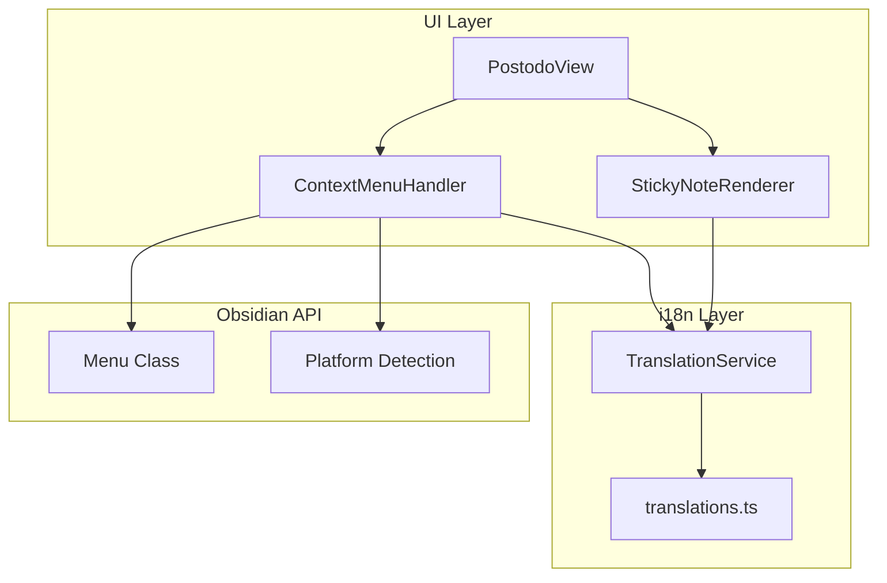

# 設計ドキュメント

## 概要

Postodo の付箋UIを改善し、右クリックコンテキストメニューを追加します。タイトル欄を削除してシンプルな見た目にし、操作は右クリックメニューに集約します。日本語・英語の多言語対応も行います。

### 主要な設計原則

- **Obsidian API 活用**: Obsidian の `Menu` クラスを使用してネイティブなコンテキストメニューを実装
- **i18n 対応**: 既存の翻訳システムを拡張して UI テキストを多言語化
- **モバイル対応**: 長押しでコンテキストメニューを表示

## アーキテクチャ



## コンポーネントとインターフェース

### ContextMenuHandler

コンテキストメニューの表示と操作を管理。

```typescript
interface IContextMenuHandler {
    showContextMenu(note: StickyNote, event: MouseEvent | TouchEvent): void;
}

interface ContextMenuItem {
    id: string;
    labelKey: string;  // i18n キー
    icon?: string;
    callback: (note: StickyNote) => void | Promise<void>;
    submenu?: ContextMenuItem[];
}
```

### 翻訳拡張

既存の `translations.ts` に以下のキーを追加。

```typescript
interface ContextMenuTranslations {
    contextMenu: {
        openNote: string;
        edit: string;
        changeColor: string;
        changeSize: string;
        markComplete: string;
        markIncomplete: string;
        delete: string;
        copyFilename: string;
        colors: {
            yellow: string;
            pink: string;
            blue: string;
            green: string;
            orange: string;
            purple: string;
        };
        sizes: {
            small: string;
            medium: string;
            large: string;
        };
    };
    tooltip: {
        filename: string;
    };
    actionBar: {
        checkbox: string;
    };
}
```

## UI 変更

### 付箋レイアウト（変更後）

```
┌─────────────────────────────┐
│                             │
│     コンテンツエリア          │
│     (タイトル欄なし)          │
│                             │
├─────────────────────────────┤
│ [☐]                         │  ← アクションバー（チェックボックスのみ）
└─────────────────────────────┘
```

### コンテキストメニュー構造

```
┌─────────────────────────┐
│ 📄 ノートを開く          │
│ ✏️ 編集                 │
├─────────────────────────┤
│ 🎨 色を変更        ▶    │ → サブメニュー（色選択）
│ 📐 サイズ変更      ▶    │ → サブメニュー（サイズ選択）
├─────────────────────────┤
│ ✅ 完了にする / 未完了に戻す │
├─────────────────────────┤
│ 📋 ファイル名をコピー    │
│ 🗑️ 削除                 │
└─────────────────────────┘
```

### ツールチップ

ホバー時にファイル名を表示。

```typescript
noteEl.title = note.filePath;  // または note.title || note.filePath
```

## イベントハンドリング

### デスクトップ

```typescript
noteEl.addEventListener('contextmenu', (e) => {
    e.preventDefault();
    this.contextMenuHandler.showContextMenu(note, e);
});
```

### モバイル（長押し）

```typescript
let longPressTimer: number | null = null;

noteEl.addEventListener('touchstart', (e) => {
    longPressTimer = window.setTimeout(() => {
        this.contextMenuHandler.showContextMenu(note, e);
    }, 500);  // 500ms 長押し
});

noteEl.addEventListener('touchend', () => {
    if (longPressTimer) {
        clearTimeout(longPressTimer);
        longPressTimer = null;
    }
});
```

## 正確性プロパティ

### Property 1: コンテキストメニュー表示

*任意の* 付箋への右クリック操作に対して、コンテキストメニューが表示される

**Validates: Requirements 3.1**

### Property 2: メニュー項目の完全性

*任意の* コンテキストメニュー表示に対して、全ての必須メニュー項目（ノートを開く、編集、色変更、サイズ変更、完了/未完了、削除、ファイル名コピー）が含まれる

**Validates: Requirements 3.2**

### Property 3: 完了状態に応じたメニューテキスト

*任意の* 付箋の完了状態に対して、メニューテキストが「完了にする」または「未完了に戻す」に正しく切り替わる

**Validates: Requirements 3.7**

### Property 4: 多言語対応

*任意の* 言語設定に対して、コンテキストメニューのテキストが正しい言語で表示される

**Validates: Requirements 4.1, 4.2, 4.3**

### Property 5: モバイル長押し

*任意の* モバイルデバイスでの500ms以上の長押しに対して、コンテキストメニューが表示される

**Validates: Requirements 5.1**

### Property 6: ツールチップ表示

*任意の* 付箋へのホバーに対して、ファイル名がツールチップとして表示される

**Validates: Requirements 1.3**

## エラーハンドリング

| エラー種別 | 説明 | 対応 |
|------------|------|------|
| ClipboardError | クリップボードへのコピー失敗 | フォールバック通知 |
| FileOpenError | ノートファイルを開けない | エラー通知 |
| TranslationMissing | 翻訳キーが見つからない | フォールバック（英語） |

## テスト戦略

### ユニットテスト

- コンテキストメニュー項目の生成
- 翻訳キーの取得
- 完了状態に応じたメニューテキスト切り替え

### 統合テスト

- 右クリックイベントからメニュー表示
- メニュー項目選択から操作実行
- 多言語切り替え
