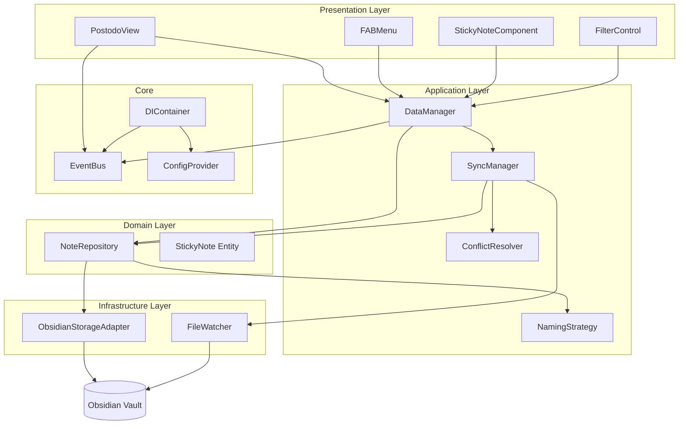

# 設計ドキュメント

## 概要

Postodo は Obsidian プラグインとして動作する付箋 Todo アプリケーションです。本設計では、疎結合なモジュラーアーキテクチャを採用し、依存性注入（DI）とイベント駆動設計により、テスト可能性と拡張性を確保します。

### 主要な設計原則

- **Single Responsibility Principle (SRP)**: 各クラスは単一の責任を持つ
- **Dependency Inversion Principle (DIP)**: 抽象に依存し、具象に依存しない
- **Event-driven Architecture**: 疎結合なコンポーネント間通信
- **Plugin Architecture**: コア機能と拡張機能の明確な分離

## アーキテクチャ



## コンポーネントとインターフェース

### コアサービス

#### DIContainer

依存性注入コンテナ。サービスの登録と解決を管理します。

```typescript
interface IDIContainer {
    register<T>(token: string, implementation: new (...args: any[]) => T, options?: ServiceOptions): void;
    registerFactory<T>(token: string, factory: (...args: any[]) => T, dependencies?: string[]): void;
    resolve<T>(token: string): T;
    has(token: string): boolean;
    clear(): void;
}

interface ServiceOptions {
    dependencies?: string[];
    singleton?: boolean;
}
```

#### EventBus

イベント駆動通信を実現するイベントバス。

```typescript
interface IEventBus {
    on<T>(event: string, listener: EventListener<T>): () => void;
    once<T>(event: string, listener: EventListener<T>): () => void;
    off<T>(event: string, listener: EventListener<T>): void;
    emit<T>(event: string, data?: T): void;
    onPattern(pattern: string, listener: EventListener): () => void;
}
```

### データ層

#### StickyNote エンティティ

付箋のドメインモデル。

```typescript
interface StickyNote {
    readonly id: string;
    readonly filePath: string;
    title: string;
    content: string;
    position: Position;
    dimensions: Dimensions;
    appearance: Appearance;
    metadata: NoteMetadata;
    completed: boolean;
}

interface Position {
    x: number;
    y: number;
    zIndex: number;
}

interface Dimensions {
    width: number;
    height: number;
}

interface Appearance {
    color: NoteColor;
    size: NoteSize;
    rotation: number;
}

type NoteColor = 'yellow' | 'pink' | 'blue' | 'green' | 'orange' | 'purple';
type NoteSize = 'small' | 'medium' | 'large';
```

#### NoteRepository

付箋データの永続化を担当。

```typescript
interface INoteRepository {
    create(options: CreateNoteOptions): Promise<Result<StickyNote>>;
    findById(id: string): Promise<Result<StickyNote | null>>;
    findAll(): Promise<Result<StickyNote[]>>;
    update(id: string, options: UpdateNoteOptions): Promise<Result<StickyNote>>;
    delete(id: string): Promise<Result<void>>;
    rename(id: string, newTitle: string): Promise<Result<StickyNote>>;
}
```

### 同期層

#### SyncManager

UI とファイル間の同期を管理。

```typescript
interface ISyncManager {
    startWatching(): void;
    stopWatching(): void;
    syncNoteToFile(note: StickyNote): Promise<Result<void>>;
    syncFileToNote(filePath: string): Promise<Result<StickyNote>>;
    isNoteBeingEdited(noteId: string): boolean;
    markNoteAsEditing(noteId: string): void;
    unmarkNoteAsEditing(noteId: string): void;
}
```

#### ConflictResolver

競合検出と解決を担当。

```typescript
interface IConflictResolver {
    detectConflict(fileNote: StickyNote, uiNote: StickyNote): ConflictType | null;
    resolveConflict(fileNote: StickyNote, uiNote: StickyNote, conflictType: ConflictType): Promise<ResolveResult>;
}

type ConflictType = 'position' | 'content' | 'metadata';

interface ResolveResult {
    success: boolean;
    result: StickyNote;
    strategy: 'file-wins' | 'ui-wins' | 'merge' | 'user-choice';
}
```

### 命名戦略

#### NamingStrategy

ファイル命名規則を管理。

```typescript
interface INamingStrategy {
    generateFileName(note: Partial<StickyNote>): string;
    parseFileName(fileName: string): { title?: string; timestamp?: Date; seqNo?: number } | null;
}

type NamingStrategyType = 'timestamp' | 'sequential' | 'custom';

// タイムスタンプ形式: Sticky-yyyyMMddHHmmss
class TimestampNamingStrategy implements INamingStrategy {
    generateFileName(note: Partial<StickyNote>): string {
        const now = new Date();
        const timestamp = formatDate(now, 'yyyyMMddHHmmss');
        return `Sticky-${timestamp}`;
    }
}

// 連番形式: Sticky-{seqNo}
class SequentialNamingStrategy implements INamingStrategy {
    constructor(private repository: INoteRepository) {}
    
    async generateFileName(note: Partial<StickyNote>): Promise<string> {
        const nextSeqNo = await this.getNextSequenceNumber();
        return `Sticky-${nextSeqNo.toString().padStart(4, '0')}`;
    }
}
```

### UI層

#### DisplayFilter

表示フィルターの管理。

```typescript
type DisplayFilterType = 'incomplete' | 'complete' | 'all';

interface IDisplayFilter {
    currentFilter: DisplayFilterType;
    setFilter(filter: DisplayFilterType): void;
    shouldDisplay(note: StickyNote): boolean;
}
```

## データモデル

### Note_File フォーマット

Postodo フォルダ内のマークダウンファイル形式。

```markdown
---
id: "note-uuid-here"
position:
  x: 100
  y: 200
  zIndex: 1
dimensions:
  width: 200
  height: 180
appearance:
  color: "yellow"
  size: "medium"
  rotation: 2
completed: false
created: "2026-01-10T10:00:00.000Z"
modified: "2026-01-10T10:30:00.000Z"
tags: []
---

# タイトル

本文の内容がここに入ります。
```

### サイズ定義

| サイズ | 幅 | 高さ |
|--------|-----|------|
| small | 150px | 150px |
| medium | 200px | 180px |
| large | 250px | 220px |

### カラー定義

| カラー名 | 値 |
|----------|------|
| yellow | #ffeb3b |
| pink | #f8bbd9 |
| blue | #90caf9 |
| green | #a5d6a7 |
| orange | #ffcc80 |
| purple | #ce93d8 |

## 正確性プロパティ

*正確性プロパティは、システムの全ての有効な実行において真であるべき特性や振る舞いを形式的に記述したものです。プロパティは人間が読める仕様と機械で検証可能な正確性保証の橋渡しとなります。*

### Property 1: 付箋作成時のファイル生成

*任意の* 有効な付箋作成操作に対して、Postodo_Folder 内に対応する Note_File が作成され、付箋の ID とファイルパスが一致する

**Validates: Requirements 1.3, 1.4**

### Property 2: 空コンテンツの作成拒否

*任意の* 空文字列またはホワイトスペースのみのコンテンツに対して、付箋作成は拒否され、既存の付箋リストは変更されない

**Validates: Requirements 1.5**

### Property 3: ファイル命名規則の適用

*任意の* 付箋作成時に、設定された Naming_Strategy に従ったファイル名が生成される

**Validates: Requirements 1.6, 1.7, 13.3**

### Property 4: タイトル変更時のファイル名同期

*任意の* 付箋のタイトル変更に対して、対応する Note_File のファイル名が新しいタイトルに変更される

**Validates: Requirements 2.5**

### Property 5: UI変更のファイル同期（ラウンドトリップ）

*任意の* UI での付箋変更に対して、変更内容が Note_File に保存され、ファイルを再読み込みすると同じ内容が復元される

**Validates: Requirements 2.2, 7.1**

### Property 6: ファイル変更のUI同期

*任意の* Note_File の外部変更に対して、対応する Sticky_Note の表示が更新される

**Validates: Requirements 2.3, 7.2**

### Property 7: ドラッグ位置の境界制限

*任意の* ドラッグ操作に対して、付箋の位置は Canvas の表示可能な範囲内に制限される

**Validates: Requirements 3.4**

### Property 8: 完了ステータスとフィルターの連動

*任意の* 付箋と Display_Filter の組み合わせに対して、フィルター条件に基づいて正しく表示/非表示が決定される

**Validates: Requirements 4.2, 4.3, 4.6**

### Property 9: 削除時のファイル削除

*任意の* 付箋削除操作に対して、対応する Note_File が Postodo_Folder から削除される

**Validates: Requirements 5.2**

### Property 10: 外観変更の永続化

*任意の* 付箋の色またはサイズ変更に対して、変更内容が Note_File に永続化される

**Validates: Requirements 6.3, 6.4**

### Property 11: 位置競合時のUI優先

*任意の* 位置競合が検出された場合、UI 側の位置が優先される

**Validates: Requirements 8.1**

### Property 12: コンテンツ競合時の新しい方優先

*任意の* コンテンツ競合が検出された場合、より新しい変更が優先される

**Validates: Requirements 8.2**

### Property 13: メタデータ競合時のマージ

*任意の* メタデータ競合が検出された場合、競合しないフィールドがマージされる

**Validates: Requirements 8.3**

### Property 14: 同期失敗時のリトライ

*任意の* 同期失敗に対して、指数バックオフで最大3回まで再試行される

**Validates: Requirements 7.4**

### Property 15: データ復元時の整合性検証

*任意の* 無効な位置データを含む Note_File に対して、位置が Canvas 内に修正される

**Validates: Requirements 11.2, 11.3**

### Property 16: DIコンテナのシングルトン保証

*任意の* シングルトンとして登録されたサービスに対して、複数回の resolve で同一インスタンスが返される

**Validates: Requirements 12.1, 12.3**

### Property 17: DIコンテナの依存関係解決

*任意の* 依存関係を持つサービスに対して、依存関係が再帰的に解決される

**Validates: Requirements 12.2**

### Property 18: イベントバスのパターンマッチング

*任意の* ワイルドカードパターンに対して、マッチするイベントが正しくリスナーに配信される

**Validates: Requirements 12.4**

### Property 19: 連番の一意性保証

*任意の* 連番形式での付箋作成に対して、既存のファイルと重複しない連番が生成される

**Validates: Requirements 13.5**

## エラーハンドリング

### エラー分類

| エラー種別 | 説明 | 対応 |
|------------|------|------|
| FileNotFoundError | ファイルが見つからない | 警告ログ、UI から削除 |
| FileWriteError | ファイル書き込み失敗 | リトライ、ユーザー通知 |
| ValidationError | データ検証失敗 | デフォルト値適用、警告ログ |
| ConflictError | 競合検出 | 解決戦略適用 |
| SyncError | 同期失敗 | リトライ、ステータス表示 |

### Result 型

全ての非同期操作は Result 型を返し、エラーを明示的に処理します。

```typescript
type Result<T, E = Error> = 
    | { success: true; data: T }
    | { success: false; error: E };
```

## テスト戦略

### テストアプローチ

- **ユニットテスト**: 個別コンポーネントの機能検証
- **プロパティベーステスト**: 正確性プロパティの検証（fast-check 使用）
- **統合テスト**: コンポーネント間の連携検証

### プロパティベーステスト設定

- 最小100回のイテレーション
- 各テストは設計ドキュメントのプロパティを参照
- タグ形式: **Feature: postodo-sticky-notes, Property {number}: {property_text}**

### テストカバレッジ目標

| 層 | カバレッジ目標 |
|----|---------------|
| Domain Layer | 90% |
| Application Layer | 85% |
| Infrastructure Layer | 80% |
| Presentation Layer | 70% |

